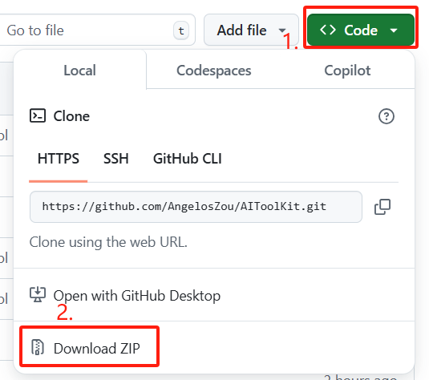
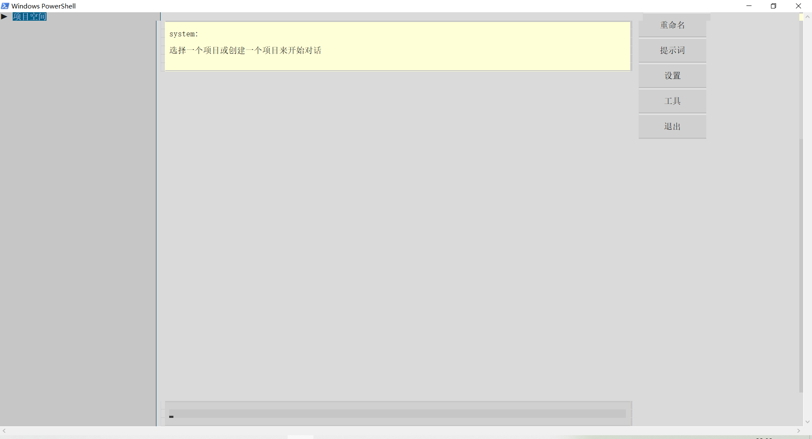
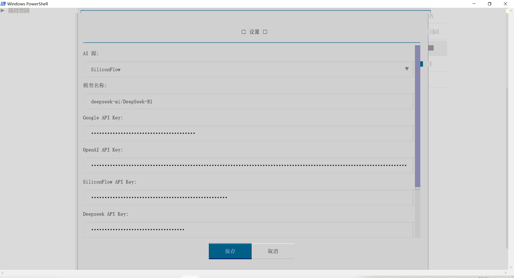

# AIToolKit  - 让AI使用工具


[](LICENSE)  <!-- 添加徽章 -->

**为AI模型提供多种工具链**，支持通过服务商API或本地Ollama调用以下能力：
- 🔍 联网搜索与网页抓取
- 📚 学术论文检索与推荐
- 💻 本地代码编写/测试/调试
- 🖥️ 终端可视化交互界面

## 目录
- [⚡ 安装](#-安装)
- [🚀 快速开始](#-快速开始)
- [📡 AI源与模型](#-ai源与模型)
- [💬 创建项目与对话](#-创建项目与对话)
- [💾 参考文件与代码空间](#-参考文件与代码空间)
- [💭 提示词](#-提示词)
- [🔧 工具](#-工具)
- [🚽 快捷键](#-快捷键)
- [💈 指令](#-指令)
- [💻 开发指南](#-开发指南)


<a name="-快速开始"></a>
## ⚡ 安装
项目使用 Python 解释器，请首先确保已安装 [Python](https://www.python.org/)。

使用 git 克隆项目到本地：
```bash
git clone https://github.com/AngelosZou/AIToolKit.git
```

或者直接下载项目压缩包



在项目根目录下打开[终端](./README/cmd.md)，安装项目依赖：
```bash
pip install -r requirements.txt
```

(如果出现版本冲突，尝试使用 [3.10.6](https://www.python.org/downloads/release/python-3106/) 版本的 Python 解释器)


## 🚀 快速开始
在项目根目录打开终端(win建议使用 PowerShell，使用cmd部分快捷键可能无法使用)，运行以下命令：
```bash
python main.py
```
如果存在多个Python版本，请使用别名指定Python解释器版本或使用环境管理器。

这一指令将打开终端交互界面：


首先，点击设置，打开设置界面。

其中，AI源为AI服务商，目前内置了本地Ollama, 服务商OpenAI, DeepSeek, SiliconFlow的接口，需要在AI源选择框中选择需要使用的AI服务商。

AI模型为服务商使用的AI模型。

## 📡 AI源与模型

- [Ollama](https://ollama.com/)为本地运行的模型，需要在本地安装Ollama与模型。在使用Ollama时，需要确保Ollama已经启动。可用打开终端并使用：
  ```bash
   ollama
   ```
  来启动Ollama。启动后通过指令:
    ```bash
    ollama list
    ```
  查看所有可用模型。对于DeepSeek的模型，常用的有： **DeepSeek-R1:7b** | **DeepSeek-R1:8b** | **DeepSeek-R1:14b** | **DeepSeek-R1:32b**

   


- OpenAI需要在[API平台](https://platform.openai.com/api-keys)注册并获取OpenAI的API。OpenAI的推荐模型为**o1-mini**以及**o3-mini**。但需要注意的是**o3-mini**目前只有Tier 3用户才能使用，需要在OpenAI的API平台付费7天以上100美元以上才能使用。


- DeepSeek需要注册并[获取API](https://platform.deepseek.com/)，然而当前DeepSeek的API平台由于访问过大已经停止付费了，暂时用不了。DeepSeek的建议模型为**deepseek-reasoner**


- SiliconFlow需要注册并[获取API](https://cloud.siliconflow.cn/i/ipbTzWIp)。需要注意的是当前SiliconFlow似乎只能使用+86手机号注册。（没注册的话可以填下我的邀请码捏 ipbTzWIp，点[这里](https://cloud.siliconflow.cn/i/ipbTzWIp)注册）通过SiliconFlow使用的R1模型为**deepseek-ai/DeepSeek-R1**

选择你需要使用的AI源后，在设置中填写对应的API Key。请注意，**API Key是私密信息，泄露可能造成经济损失，请妥善保存。**

如果希望项目支持更多的服务商，请查看下文的[开发指南](#-开发指南)。或创建一个相关的[issue](https://github.com/AngelosZou/AIToolKit/issues)。

### ⚠ **本程序中，所有API密钥会保存在根目录的 ./configure.json 文件中，请谨防文件泄露！**

如果需要使用谷歌搜索（免费用户每天100次），需要先[获取API](https://console.cloud.google.com/apis/credentials)，再[设置搜索器](https://programmablesearchengine.google.com/controlpanel/create)。将API与CSE ID填入设置中即可。
   
设置中的“最大跳过次数”表明AI最多可以连续多少次跳过用户输入来继续执行任务，这在调试代码时会很有用，设置为-1时不施加限制。如果担心AI一直跑不出来跑太久可能把钱烧光，可以设置一个值。

<a name="-创建项目与对话"></a>
## 💬 创建项目与对话
完成设置后，点击界面左侧“项目空间”来查看有哪些项目。所有项目文件保存在 ./projects 文件夹中。点击“新建项目”来创建一个新项目。
每一个项目会记录多个对话，并共享参考文件与代码空间。项目中的每个AI都会看到参考文件与代码空间中的实时文件（而非开始对话时的文件，此后文件修改了AI也只会看到修改后的文件）。

## 💾 参考文件与代码空间
进入项目后，在左侧边栏有参考文件与代码空间的路径，分别对应本地 ./projects/[项目名称]/ref_space 与 ./projects/[项目名称]/code_space 的文件夹。通过点击新建文件可以在文件浏览器中选择文件复制到对应的目录中。在同一个项目中的所有对话的AI都会实时看到两个文件夹中的所有文件的最新状态（会覆盖AI看到的文件的历史状态）。其中参考文件只能由用户操作，代码空间可以被AI修改。点击左侧栏的对应文件名可以选择是否删除对应的文件。

## 💭 提示词
点击“新建对话”来创建一个新对话。在进入一个对话后，点击右侧栏的“提示词”来选择为AI加载提示词。提示词的修改对单个对话生效。提示词的修改实时生效，将覆盖AI的原始记忆，但不会覆盖AI的对话记录。可以通过在 ./resource/prompt 文件夹中创建 .txt 文件来添加新的提示词。但需要注意，所有对话在初始化时默认加载全部提示词，请注意取消不需要的提示词。

## 🔧 工具
点击右侧栏的“工具”来设置AI可以使用哪些工具。目前有这些工具可以使用：
- **缓存工具**：用于给别的工具提供信息。
- **总结工具**：用于总结缓存的内容、长的网页、文件。该工具通过调用一个AI来进行总结。（会花钱花时间）
- **获取网页工具**：用于获取指定url网页的内容，需要联网，AI要先知道url才能查，所以一般和搜索工具一起使用。
- **搜索工具**：通过谷歌搜索指定关键词，返回5条内容，但只有链接和标题，AI会自己分析要不要获取内容。注意API的使用次数限制。


- **论文检索工具**：通过指定关键词在Semantic Scholar上搜索论文，包括标题、摘要、引用、年份。不需要API，但可能会遇到官网的速率限制。
- **论文推荐工具**：Semantic Scholar的奇妙小功能，可以通过已经搜索到的论文进一步推荐猜你喜欢。


- **代码编写工具**：可以往本地代码空间写入文件，这个操作是安全的，AI不能操作代码空间之外的任何文件。但代码空间内的文件可能被AI覆写。代码空间的路径是./projects/项目名称/code_space/，请注意备份该路径下的重要文件。
- **代码运行工具**：运行 代码空间 中 main.py 文件的 main() 函数。运行会捕捉终端输出反馈给AI。虽然AI确实有可能通过这个操作来越过限制修改文件，但AI应该想不到。~~由于后来写了测试工具和调试工具，这个工具也在弃用的边缘了~~
- **代码测试工具**：使用 pytest 框架运行 代码空间 中 test.py 文件的所以测试例。如果测试失败，AI会获得反馈并跳过用户输入来尝试修复。
- **代码调试工具**：会启动一个子系统，使用一个代理AI在子系统中不断地编写代码、测试代码，直到所有测试全部通过。由于子系统每次都只能看到当前的代码、测试结果，不受历史记录的干扰，会比主AI直接调试代码更高效。


类似于提示词，通过右侧边栏可以设置工具的启用状态，这也是会实时生效，绑定到对话而非项目。（虽然修改工具会覆盖AI对于工具的记忆，但是如果在对话中AI曾经使用过被关闭的工具，AI仍然可能推断出其语法）


## 🚽 快捷键
由于cmd的一些快捷键被占用，这个程序设置了一些替代的快捷键选择：
- 使用鼠标光标选择对话历史记录的任何文本都会直接复制到剪贴板。
- 在输入框中使用Enter来换行
- 在输入框中使用ctrl+l来发送消息
- 在输入框中使用ctrl+o来粘贴消息


~~我知道这些操作很不符合习惯，但是tui中大部分常用的快捷键都用不了~~

使用PowerShell而不是cmd可以使用一些常用的快捷键，比如复制粘贴。

## 💈 指令
在输入中使用 /help 来查看指令。指令的大部分内容都被侧边栏覆盖了，但也可以通过指令来向AI发送特定网页、文件。
- /fetch [网页链接]  获取网页信息中的内容放到缓存例
- /file [本地文件路径] 读取本地文件内容放到缓存例
- /summary 用缓存例中的内容启动总结工具
- /submit 直接把缓存发给AI


## 💻 开发指南
一周速成的项目，有很多毛病，等我写完作业了再来整理代码，欢迎朋友们来提issue开PR。


如果希望开发新的工具，可以在 ./tool 文件夹中新建py文件，并继承 BaseTool 类，使用 @ToolRegistry.register 进行装饰即可自动注册到工具列表中。实现 parse 方法来解析输出中的工具，再实现 execute 来制作处理逻辑。最后在 ./resource/prompt/tool 文件夹中创建一个与注册名称相同的.txt文件描述工具的用途语法限制就可以了。参考[对应路径中的文件](./tool/code.py)


如果想开发新指令，在 ./command 文件夹中创建py文件，继承 Command 类，使用 @registry.register 进行装饰，使用path参数指定语法，使用description参数进行描述，使用usage参数举例，实现 execute 方法来处理逻辑就行了。参考[对应路径中的文件](./command/model.py)


如果想支持别的AI服务商，在 ./core/source 文件夹中创建py文件，继承 BaseSource 类，使用@SourceRegistry.register装饰来自动注册，实现is_available来检查源是否可用，实现create_stream方法来创建一个源，实现catch_chunk_in_stream方法来将chunk处理成文本就行了。需要注意推理模型需要将推理文本与输出文本区分开来。参考[对应路径中的文件](./core/source/deepseek.py)


